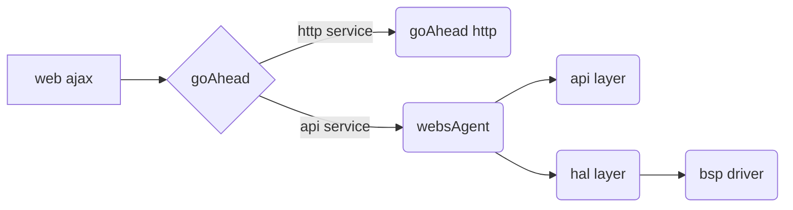

[TOC]
# 项目情况简介
* 本项目是基于 goAhead 开源 web server。
* goAhead官方文档
   https://www.embedthis.com/goahead/doc/ref/api/goahead.html
* 本项目以 ***makefile*** 方式构建项目，同时相关脚本文件以 ***`bash`*** 编写，所以代码最好在 ***`Linux`*** 下进行编译调试或者 ***`Windows10-WSL`*** 方式运行。
* 本项目有以下两个子项目：
## 子项目1：yutWebsAgentDemo    
直接基于goAhead的代码和 makefile 的定制指南。   
此子项目 demo 了如何直接从 goAhead 的源代码和 makefile 基础上进行定制的方法。   
使用这种方法可以保持 goAhead 的原始做法，相对简单，但不利之处是对自己的定制代码与 goAhead 相互侵入，不利于维护。   
此子项目所有代码和 makefile 文件在目录 ***`./demo_howto_customize_by_goahead_mk`***中。   
代码中所有重要的修改处都以 ***yutWebsAgentDemo*** 作为标记以方便大家阅读比较。
* #### 详细内容=> [yutWebsAgentDemo定制细节](#Project_yutWebsAgentDemo)
## 子项目2：yut_webs_agent    
此项目将定制代码与 goAhead 代码进行了解耦。    
对goAhead的 makefile 进行了较多改造，集成了 ajax 交互方式的所有 web/api/hal 层的演示。您可以直接将其替换为自己的 web 和 api/hal 代码实现一个完整的嵌入式 wesAgent服务。      
此子项目所有代码和 makefile 文件在目录 ***`./yut_webs_agent_src 和 ./ yut_webs_agent_websrc`*** 中。   
代码中所有重要的修改处都以 ***yut_webs_agent*** 作为标记以方便大家阅读比较。
* #### 详细内容=> [yut_webs_agent定制细节](#Project_yut_webs_agent)   
------------------------
# demo代码如何运行
1. 准备环境
   * **方法一Linux**：准备好Linux下的工作目录
   * **方法二Windows**：打开Windows10-WSL Ubuntu环境并准备好工作目录
2. clone代码
    ```
    https://gitee.com/cmajor-cd/yutWebsAgent.git
    https://github.com/cmajor-cd/yutWebsAgent.git
    ```
3. 进入源码目录并运行编译和发布脚本
    ```
    $ cd demo_howto_customize_by_goahead_mk/
    $ ./build.sh
    $ ./releaseGo.sh or sudo ./releaseGo.sh
    ```
    系统显示处如下log意味着运行成功。
    ```
    yangyt@DESKTOP-MI7438E:/mnt/d/workspace/demo_howto_customize_by_goahead_mk$ ./releaseGo.sh
    [sudo] password for yangyt:
    goahead: 2: Configuration for Embedthis GoAhead Community Edition
    goahead: 2: ---------------------------------------------
    goahead: 2: Version:            5.1.0
    goahead: 2: BuildType:          Debug
    goahead: 2: CPU:                x64
    goahead: 2: OS:                 linux
    goahead: 2: Host:               127.0.1.1
    goahead: 2: Directory:          /mnt/d/workspace/VS/yutWebsAgent/release/webserver
    goahead: 2: Documents:          /mnt/d/workspace/VS/yutWebsAgent/demo_howto_customize_by_goahead_mk/../release/webroot
    goahead: 2: Configure:          me -d -q -platform linux-x86-default -configure . -gen make
    goahead: 2: ---------------------------------------------
    goahead: 2: Started http://0.0.0.0:8080
    ```
4. 检查web运行情况。
* 打开浏览器并输入地址： `http://127.0.0.1:8080/demo.html`
* 显示demo页面
    <div><h4>用form提交数据=>form</h4></div>
    <form action=/action/yutWebsAgentDemoEntry method="post">
        <table>
        <tr><td>命令:</td><td><a>submitNameValue</a></td></tr>
        <tr><td>账号:</td><td><a> nameValue </a></td></tr>
        <tr><td>密码:</td><td><a>pwdValue</a></td></tr>
        <tr><td><input type="submit" name="submit" value="submit"></td>
            <td><input type="reset" value="reset"></td></tr>
        </table>
    </form>
    <div><h4>用ajax刷新=>触发getNetworkCfgInfor()</h4>
        <div id="myDemoText"></div>
    </div>
    <button type="button" onclick="getNetworkCfgInfor()">AJAX刷新</button>

------------------------
# 目录说明
```
yutWebsAgent
├── build
│   ├── bin
│   ├── inc
│   └── obj
├── demo_howto_customize_by_goahead_mk
│   ├── build.sh
│   ├── releaseGo.sh
│   ├── webroot
│   │   ├── demo.html
│   │   ├── demo.js
│   ├── yut_webs_agentdemo.c
│   └── yut_webs_agentdemo.mk
├── goahead_src
│   ├── projects
│   │   ├── goahead-linux-default-me.h
│   │   ├── goahead-linux-default.mk
├── libs
├── release
│   ├── webroot
│   └── webserver
├── yut_webs_agent_src
│   ├── api
│   ├── hal
└── yut_webs_agent_websrc
```
1. **goahead_src**
   * goahead的官方源代码。
   * 该目录被 build.sh 引用。
   * 如果要改动需要同步变更 build.sh 脚本中定义的：```$goahead_src_dir / $goahead_src_projects_dir```
2. **demo_howto_customize_by_goahead_mk**
   * ***子项目1*** 的演示代码目录
   * 移植定制文件目录，您可以变更为您自己的目录名。
   * 如果要改动 **该目录名** 需要同步变更同级目录下的makefile文件``yut_webs_agentdemo.mk`` 脚本中的```SRC_CODE_DIR```定义。
   * 该目录包含的文件
     * source files
     * makefile文件: 缺省的mk文件名为```yut_webs_agentdemo.mk```，该文件需与`build.sh`脚本中的``$mk_filename``定义保持一致。 
     * build.sh编译脚本文件，该脚本定义了build-make方法，请注意定制是保证以下内容正确：
        ```
        goahead_src_dir="../goahead_src"
        goahead_src_projects_dir="../goahead_src/projects"
        build_dir="../build"
        mk_filename="yut_webs_agentdemo.mk"
        ```
     * releaseGo.sh调试发布脚本文件，该脚本将自定义的源文件编译完成并将最终的bin文件和相关文件+web app代码发布到``./release``目录下，请注意定制是保证以下内容正确：
        ```
        rel_webs_bin_dir="../release/webserver"
        rel_webs_root_dir="../release/webroot"
        build_bin_dir="../build/bin"
        build_webs_root_dir="./webroot"
        build_bin_filename="yut_webs_agentdemo.bin"
        goahead_src_dir="../goahead_src"    
        ```
   * 该目录中的子目录
     * webroot: web app的源代码目录，请保证**该子目录名**与`releaseGo.sh`脚本中的``$build_webs_root_dir``保持一致。
3. **yut_webs_agent_src**
   * ***子项目2*** ***yut_webs_agent*** 的 .c / makefile 代码演示代码目录。   
   * 其文件组成与***子项目1***类似。
4. yut_webs_agent_websrc
   * ***子项目2*** ***yut_webs_agent*** 的 web 代码演示代码目录。   
5. libs
   * 3方库文件存放目录。
   * 该**目录名**需要与``yut_webs_agentdemo.mk/webs_agent.mk`` 脚本中的```LIBS_3rd```定义保持一致。
6. build   
    build.sh编译脚本，编译定制代码后的输出文件存放目录。
7. release   
    `releaseGo.sh`发布编译结果所在的文件目录。   
    注意：如果是最终发布，需要确保``./release/webroot/``中的web app代码已经编译过。因为```releaseGo.sh```没有检查本web app的代码是否已经编译过！

------------------------

# 子项目yutWebsAgentDemo定制说明<div id="Project_yutWebsAgentDemo"></div>
此子项目 demo 了如何直接从 goAhead 的源代码和 makefile 基础上进行定制的方法。   
使用这种方法可以保持 goAhead 的原始做法，相对简单，但不利之处是对自己的定制代码与 goAhead 相互侵入，不利于维护。   
## 1.构建项目定制源代码目录
* 按照demo的目录结构构建自己的目录
  * 可以简单的 ``git clone``，也可以手工构建。
  * 将子目录名 ``yut_webs_agentdemo`` 改为自己的目录名，该目录存放自己的代码文件。
* 构建自己的makefile文件
  * 参考demo中的 ``yut_webs_agentdemo.mk`` 创建自己的makefile文件。请注意该makefile文件的模板来自于``../goahead/projects``，您可以直接copy其中合适的mk文件过来并修改为**自定义文件名**。
* 修改`build.sh`文件
  * 修改 ``build.sh`` 脚本中的 ``$mk_filename`` 为与上一节相同的**自定义文件名**。
  * 以本目录为base确保以下路径和目录名定义正确。
    ```
    goahead_src_dir="../goahead_src"
    goahead_src_projects_dir="../goahead_src/projects"
    ```
* 修改``releaseGo.sh``文件，请注意定制是保证以下内容正确：
  * 修改 ``releaseGo.sh`` 脚本中的 ``$build_bin_filename`` 为与希望生成的最终bin文件的**自定义文件名**相同。
  * 以本目录为base确保以下路径和目录名定义正确。
    ```
    rel_webs_bin_dir="../release/webserver"
    rel_webs_root_dir="../release/webroot"
    build_bin_dir="../build/bin"
    build_webs_root_dir="./webroot"
    build_bin_filename="yut_webs_agentdemo.bin"
    goahead_src_dir="../goahead_src"    
    ```
## 2.定制makefile文件
### 2.1.行为说明   
    编译中 ``build.sh`` 脚本会将makefile文件拷贝到 ``$goahead_src_projects_dir`` 中，并执行make。
### 2.1.定制方法   
* **PROFILE**   
  如果是按照goahead官方的方法定制, build目录将在goahead目录下，该参数将影响**$CONFIG**，最终决定了build的目录位置。   
  在使用本方法定制时，我们更改了build目录位置到父一级目录，所以该参数无意义。
* **ARCH**   
  根据具体的情况来定义，比如：`ARCH ?=arm`
* **CC**   
  根据具体的情况来定义。
    * 比如，在Ubuntu下调试可以设置为：`CC ?= gcc`
    * 比如，在ARM下调试可以设置交叉编译环境为：`CC ?=arm-fsl-linux-gnueabi-gcc`
* **BUILD**   
  为了方便组织代码和调试，我们将 `$BUILD` 设置到父一级目录，同时为了添加**三方库**和方便组织**定制源码**需要增加两个变量 `$LIBS_3rd / $SRC_CODE_DIR`。
    ```
    BUILD        ?= ../build
    LIBS_3rd     ?= ../libs
    SRC_CODE_DIR ?= ../yut_webs_agentdemo
    ```
    ***注意***：`$SRC_CODE_DIR` 需要与您的**定制源码子目录**保持一致！
* **开放和关闭官方模块**   
    可以通过设置相应的项为``1/0``来开放或关闭官方提供的独立模块。   
    比如：关闭SSL模块   
    ``ME_COM_SSL ?= 0``
* **TARGETS**   
    根据自己的规划定义build输出bin文件信息：
    ```
    TARGETS += $(BUILD)/bin/yut_webs_agentdemo.bin
    ```
    ***注意***：`yut_webs_agentdemo.bin` 需要与您在后面设置的**link输出bin文件名**保持一致！
* **clean:**   
    将自己添加的`libs`以及`定制源文件`编译的中间文件和输出文件名加入`clean`中，以达成`make clean`操作时能够清理相关文件。
    ```
    rm -f "$(BUILD)/obj/yut_webs_agentdemo.o"
	rm -f "$(BUILD)/obj/cJSON.o"
	rm -f "$(BUILD)/bin/yut_webs_agentdemo.bin"
    ```
* **compile lib / source files**   
    仿照mk文件中其他`lib`和`source files`的编写方式编写新的`lib`和`soure files`编译脚本。
    ***注意：***
    * mk变量定义要唯一，如：`DEPS_yut_cjson_1` 和 `DEPS_yut_main_1`
    * lib库路径和soure files路径要正确，如：`$(LIBS_3rd)` 和 `$(SRC_CODE_DIR)`
* **link lib / source files**   
    仿照mk文件中其他`goahead-test`的编写方式编写新的`TARGETS`链接输出脚本。
    ***注意：***
    * mk变量定义要唯一，如：`DEPS_yut_main_x`
    * TARGETS的名字要正确，如：`yut_webs_agentdemo.bin`
* **other link output**   
    对官方提供其他 features 的链接输出配置，可以根据具体的需求保留相关配置或者注释掉。   
    比如，样例mk中将 `gopass` 注释掉后，该模块不再 `link` 出目标bin文件。

## 3.定制 main.c(goAction方式)的功能代码<div id="Project_yutWebsAgentDemo_main_c"></div>   
    作为样例的main.c文件 yut_webs_agentdemo.c，来自于goAhead官方的样例文件 ./goahead_src/test.c。其中有一些不需要内容已经删除，保留了主要的、与goAction编程相关的以便于作为demo阅读。
### 3.1.action处理函数声明和注册
* **声明action处理函数**   
    在文件头部声明action处理函数，如： 
    ```
    static void actionWebsAgentDemoEntry(Webs *wp);
    ```
* **注册action处理函数**   
    在`main()`函数中注册action处理函数，如： 
    ```
    websDefineAction("yutWebsAgentDemoEntry", actionWebsAgentDemoEntry);
    ```
* **action函数编写样例**   
    ```
    //yutWebsAgentDemo
    //static void actionTest(Webs *wp);
    static void actionWebsAgentDemoEntry(Webs *wp);
    /****** Code *******/
    MAIN(goahead, int argc, char **argv, char **envp)
    {
        /*argc 处理过程略... */
        /*initPlatform()  处理过程略.. */

        //yutWebsAgentDemo
        //1. regist the yutWebsAgentDemoEntry in web url
        //2. define the function for this entry
        websDefineAction("yutWebsAgentDemoEntry", actionWebsAgentDemoEntry);
        //
        if (duration) {
            printf("Running for %d secs\n", duration);
            websStartEvent(duration * 1000, (WebsEventProc) exitProc, 0);
        }
        websServiceEvents(&finished);
        logmsg(1, "Instructed to exit\n");
        websClose();
        return 0;
    }
    ```
### 3.2.action处理函数实现(form提交方式)
#### 3.2.1.FORM技术特点   
form data 是html技术中常用的数据提交和刷新方式，它的主要特点如下：
* ***全页面*** 刷新。
* 它的html代码形态，样例：
    ```
    <form action=/action/yutWebsAgentDemoEntry method="post">
        <table>
        <tr><td>命令:</td><td><input type="text" name="command" value="submitNameValue"></td></tr>
        <tr><td>账号:</td><td><input type="text" name="name"></td></tr>
        <tr><td>密码:</td><td><input type="password" name="address"></td></tr>
        <tr><td><input type="submit" name="submit" value="submit"></td>
            <td><input type="reset" value="reset"></td></tr>
        </table>
    </form>
    ```
    <form action=/action/yutWebsAgentDemoEntry method="post">
        <table>
        <tr><td>命令:</td><td><a>submitNameValue</a></td></tr>
        <tr><td>账号:</td><td><a> nameValue </a></td></tr>
        <tr><td>密码:</td><td><a>pwdValue</a></td></tr>
        <tr><td><input type="submit" name="submit" value="submit"></td>
            <td><input type="reset" value="reset"></td></tr>
        </table>
    </form>
* 它的http数据格式，样例：```command=submitNameValue&name=&address=&submit=submit```
#### 3.2.1.goAction处理方式   
goAction提供了API函数可以直接处理FORM样式数据。样例如下:
```
int SUBMIT_NAME_VALUE_func(Webs *wp){
    cchar *name, *address;

    name = websGetVar(wp, "name", NULL);
    address = websGetVar(wp, "address", NULL);
    websSetStatus(wp, 200);
    websWriteHeaders(wp, -1, 0);
    websWriteEndHeaders(wp);
    websWrite(wp, "<html><body><h2>demo name: %s, demo address: %s</h2></body></html>\n", name, address);
    websFlush(wp, 0);
    websDone(wp);
}
```
### 3.3.action处理函数实现(ajax提交方式)<div id="Project_yutWebsAgentDemo_cjson"></div>   
大多数web页面都要求进行局部刷新，所以处理ajax是必不可少的能力。goAhead官方没有提供直接的API来处理ajax。但它的API结构中有名为`Webs`的数据结构，其保存了所有的`http消息`信息，我们可以通过Webs中的数据来处理ajax请求。
#### 3.3.1.导入cJSON库   
    外部三方库的引入方式前面章节已经详细讲解，请直接参考前面章节。
#### 3.3.2.获取输入数据buff   
我们可以通过goAction提供的API函数 `bufLen() / bufGetBlk() `来获取Webs中原始数据。
* 获取输入http数据缓冲区：`wp->input`
* 获取缓冲区数据用于后续处理: buff中即是获取的`json`数据包。
```
    //* get input buff
    char buff[MAX_INPUT_BUFF];
    int len = bufGetBlk(&(wp->input), buff, bufLen(&(wp->input)));
    buff[len] = '\0'; //插入结束符
```
#### 3.3.3.转换json数据到value   
我们使用`cJSON`的API函数来完成转换工作。
```
    cJSON* p_json_root = NULL;
    cJSON* p_json_node = NULL;
    char* p_json_node_value;
    //
    /* get input buff
     * => buff[len] 已经就绪
     */
    //* decode json object by cJSON libs' api
    p_json_root = cJSON_Parse(buff);
    if(!p_json_root)
    {
        printf("Error[actionWebsAgentDemoEntry] : [%s]\n", cJSON_GetErrorPtr());
        return;
    }
    else
    {
        p_json_node = cJSON_GetObjectItem(p_json_root, JSON_COMMAND);
        p_json_node_value = cJSON_GetStringValue(p_json_node);
        printf("Log[ajax-command] : [%s]\n", p_json_node_value);
        /* p_json_node_value 中即为与 JSON_COMMAND 对应的Value //#define JSON_COMMAND "command"
        */
        ...后续处理代码
    }
```
#### 3.3.4.打包json数据回传web app
* **构建 response json包**
    * response包的格式定义如下：
        ```
        //echo result JSON格式：
            { "rc: 0/1, 
            "errCode: "error msg txt",
            "dat:{"key1":"xxValue"}
            }
        ```
    * 利用cJSON库的API打包
        ```
        #define JSON_DAT "dat"
        #define JSON_ERRCODE "errCode"
        #define JSON_RC "rc"
        #define KEY_NAME "name"
        #define KEY_PWD "pwd"
        ...
        cJSON* _root = cJSON_CreateObject(); // create the root
        cJSON* _next = cJSON_CreateObject();
        cJSON_AddItemToObject(_root, JSON_DAT, _next); //create the node. "dat"
        // write the echo result
        // 1. fill the "dat".
        cJSON_AddItemToObject(_next, KEY_NAME, cJSON_CreateString("demo value"));
        cJSON_AddItemToObject(_next, KEY_PWD, cJSON_CreateString("demo pwd"));
        // 2. fill the "rc"
        int rc = 0; // success rc
        cJSON_AddItemToObject(_root, JSON_RC, cJSON_CreateNumber(rc));
        // 3. fill the "errCode"
        strcat(errCode, "no error!");
        cJSON_AddItemToObject(_root, JSON_ERRCODE, cJSON_CreateString(errCode));
        printf("Log[ajax-ret] : [%s]\n", cJSON_Print(_root));

        ```
* **打包到 http 消息中回传**   
此处利用goAction的API函数完成打包http并回传。
    ```
        ...
        printf("Log[ajax-ret] : [%s]\n", cJSON_Print(_root));
        // 4. fill the goAction webs return.
        websSetStatus(wp, 200);
        websWriteHeaders(wp, -1, 0);
        websWriteEndHeaders(wp);
        websWrite(wp, "%s", cJSON_Print(_root));
        websFlush(wp, 0);
        websDone(wp);
    ```
* **完整处理代码**
    ```
    //-- define the json dat, key name.
    #define KEY_NAME "name"
    #define KEY_PWD "pwd"
    int GET_NET_CFG_func(cJSON* json_node, Webs *wp){
        cJSON* _root = cJSON_CreateObject(); // create the root
        cJSON* _next = cJSON_CreateObject();
        cJSON_AddItemToObject(_root, JSON_DAT, _next); //create the node. "dat"
        int rc = 0;
        char errCode[100] = "";
        char* value;
        // write the echo result
        // 1. fill the "dat".
        cJSON_AddItemToObject(_next, KEY_NAME, cJSON_CreateString("demo value"));
        cJSON_AddItemToObject(_next, KEY_PWD, cJSON_CreateString("demo pwd"));
        cJSON_AddItemToObject(_next, JSON_COMMAND, cJSON_CreateString(_json_node_value));
        // 2. fill the "rc"
        rc = 0; // success rc
        cJSON_AddItemToObject(_root, JSON_RC, cJSON_CreateNumber(rc));
        // 3. fill the "errCode"
        strcat(errCode, "no error!");
        cJSON_AddItemToObject(_root, JSON_ERRCODE, cJSON_CreateString(errCode));
        printf("Log[ajax-ret] : [%s]\n", cJSON_Print(_root));

        // 4. fill the goAction webs return.
        websSetStatus(wp, 200);
        websWriteHeaders(wp, -1, 0);
        websWriteEndHeaders(wp);
        websWrite(wp, "%s", cJSON_Print(_root));
        websFlush(wp, 0);
        websDone(wp);
    }
    ```
## 4.定制web app内容   
web app定制主要在demo.js中完成，有以下要点。
### 4.1. 格式化json传输格式   
需要打包json数据为json字符串形式以方便http传输。
```
    var str = {
        "command":"getNetworkCfgInfor"
    }
    parameters = JSON.stringify(str);
```
### 4.2. 定义正确的ajax接收格式   
需要定义为`dataType: 'json'`。   
在调试时如果出现问题，可以尝试将其改为`dataType: 'text'`，以便查看返回的具体内容。
### 4.3. 定义正确的action处理url地址   
此处需要与您在`main()`中注册的地址完全一致，ajax包才能被正确的路由到goAction注册函数处理。例如我们样例代码中的 ***yutWebsAgentDemoEntry***
```
    //yutWebsAgentDemo
    //1. regist the yutWebsAgentDemoEntry in web url
    //2. define the function for this entry
    websDefineAction("yutWebsAgentDemoEntry", actionWebsAgentDemoEntry);
```
### 4.4. 完整的ajax处理函数样例
```
function getNetworkCfgInfor(){
    var str = {
        "command":"getNetworkCfgInfor"
    }
    parameters = JSON.stringify(str);
    $.ajax({
        type:"POST",
        url: "/action/yutWebsAgentDemoEntry",
        data: parameters,
        contentType: 'application/json',
        dataType: 'json',//'text'
        success: function(res){
            var data = res;
            if(0 == data.rc){
                let textDiv = 'SUCCESS!!<br>'+' DemoCommand:'+ data.dat.command+'<br> DemoName:'+ data.dat.name+'<br> DemoPwd:'+data.dat.pwd+'<br>';
                console.log('getNetworkCfgInfor, succ.=>'+textDiv);
                $("#myDemoText").append(textDiv);
            }
            else{
                console.log('data.errCode::'+data.errCode);
            }
        },
        error: function (errorThrown) { 
            console.log('ajax error');
            console.log(errorThrown);
        }
    });
}
```

------------------------
# 子项目yut_webs_agent定制说明<div id="Project_yut_webs_agent"></div>
此项目将定制代码与 goAhead 代码进行了解耦。    
对goAhead的 makefile 进行了较多改造，集成了 ajax 交互方式的所有 web/api/hal 层的演示。您可以直接将其替换为自己的 web 和 api/hal 代码实现一个完整的嵌入式 wesAgent服务。      
此子项目所有代码和 makefile 文件在目录 ***`./yut_webs_agent_src 和 ./ yut_webs_agent_websrc`*** 中。   
#### ***注意：*** 所有需要您关注的关键定制点都以 ***`TODO`*** 标记了出来！   
## 1. 数据流图   

## 2. 构建项目定制源代码目录    
* 构建自己的 webs_agent_src 框架源码**主目录`./yut_webs_agent_src`**，可直接参照本项目的目录结构。主目录内存放以下内容：   
  * main.c 文件(```webs_agent_main.c```)和它的 .h 头文件。该文件名如果与缺省不一致，请对应修改makefile文件中***对应的文件/目标名***。
  * makefile文件(```webs_agent.mk```)，该文件名可以自己定义。
* 框架子目录
  * ```api```应用接口层：该目录存放api层代码，该层从硬件驱动(通过```hal层```)获取/操作硬件数据，用于完成对 ajax 请求中个各条命令的一一响应。
  * ```hal```设备抽象层：该目录存放hal层代码，该层通过硬件驱动获取/操作底层硬件，提供给 api 层访问设备硬件的能力。
* `build.sh`文件
  * 本脚本运行时会将定制好的 goAhead makefile 文件拷贝到 `goAhead_src/projects`，然后在本目录运行自己的 makefile 文件``webs_agent.mk``。
  * 脚本中的路径定义都是以本目录(`./yut_webs_agent_src`)为base来确定的，请确保各路径和目录名定义正确。
* ``releaseGo.sh``文件
  * 本脚本运行时会构建 `release 目录`，并将 `build 目录` 中必须文件拷贝到 `release 目录` 中。然后启动bin文件运行并监听本地 8080 端口用于测试。
  * 以本目录为base确保以下路径和目录名定义正确。
    ```
    rel_webs_bin_dir="../release/webserver"
    rel_webs_root_dir="../release/webroot"
    build_bin_dir="../build/bin"
    build_webs_root_dir="../yut_webs_agent_websrc"
    build_bin_filename="yut_webs_agent.bin"
    goahead_src_dir="../goahead_src"   
    ```
## 3. 构建 api/hal 层代码    
目录结构参考**主目录`./yut_webs_agent_src/api 和 hal`**。   
本层的代码可以自由组织，需要注意的是子目录下的 makefile 的组织：
  * makefile的文件名必须是`makefile`，以便于上一级makefile自动调用。
  * 本级 makefile 中的 `.h` 会被 `build.sh` 脚本自动拷贝到 `../build/inc` 中。
  * 本机的所有 `.c` 文件及其对应的 `.o` 文件需要手工添加到 makefile 的依赖列表中。
## 4. 构建 webs_agent_main.c 代码    
本文件的来源细节可以查看 [子项目1：yutWebsAgentDemo`](#Project_yutWebsAgentDemo_main_c) 中的说明。
该文件主要的定制处以 `TODO` 标记，完成以下工作：
  * 定义goAction回调函数 `static void action_webs_agent(Webs *wp);`
  * 注册回调函数 `websDefineAction("webs_agent", action_webs_agent);`
  * 定制回调函数，将自己的 `api` ajax接口处理函数添加进去。
    ```
          if(!strcasecmp(p_json_node_value, SET_CFG_INFOR)){
            func_SET_CFG_INFOR(p_json_in, p_json_out);
        }else if(!strcasecmp(p_json_node_value, GET_CFG_INFOR)){
            func_GET_CFG_INFOR(p_json_in, p_json_out);
        }

    ```
  * goAction 相关的调用方法和 `cJson` 数据的处理细节可以参考 [子项目1：yutWebsAgentDemo`](#Project_yutWebsAgentDemo_cjson) 中对 `ajax cjson` 数据处理的说明。    
## 5. 构建 web 代码    
目录结构参考**主目录`./yut_webs_agent_websrc`**。   
该目录中包括了所有的 webapp 内容，可以自由组织，该目录的编写需要注意以下问题：
  * `webapp`编译发布目录如果有自己定制，请对应修改 `releaseGo.sh` 中的宏定义 `$build_webs_root_dir`，该脚本会将最终编译出的 `webapp` 代码发布到最终发布目录。
## 6. 构建 makefile    
### 6.1 本项目 makefile 文件
  * 主控makefile位于目录 `./yut_webs_agent_src`，文件名为 `webs_agent_main.mk` 该文件名可以自己定义。
  * 主控makefile运行中调用每个子目录下的子makefile。调用过程是自动的，所以子目录下的makefile文件的文件名必须是 ***`makefile`***
  * 主控makefile的内容定制方法主要点都以 `TODO` 进行了标记。
    * 根据需要定制编译平台和编译选项 `1. TODO`
    * 根据需要定制/添加其他外部模块，包括三方 Liabs 的路径 `2. TODO`
    * 根据需要定制/修改需要链接的 .o/.a 目标和库文件名 `3. TODO`
### 6.2 定制 goAhead makefile 文件
  * 文件名 `webs_agent_gohead_cust.mk`，该文件会在编译时由 `build.sh` 拷贝到 `../goahead_src/projects` 中并改名为 `makefile`。
  * 因为本项目框架对 goAhead 的代码和 makefile 进行了解耦，所以一般情况不需要再次定制 goAhead 的 makefile。该文件必须的定制处已经做了必要的定制，如需修改请对照 goAhead 的官方 makefile 进行修改。
